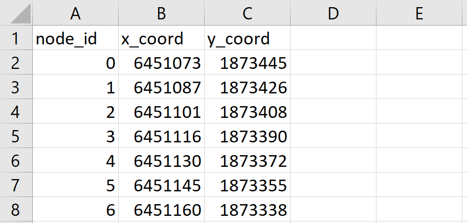
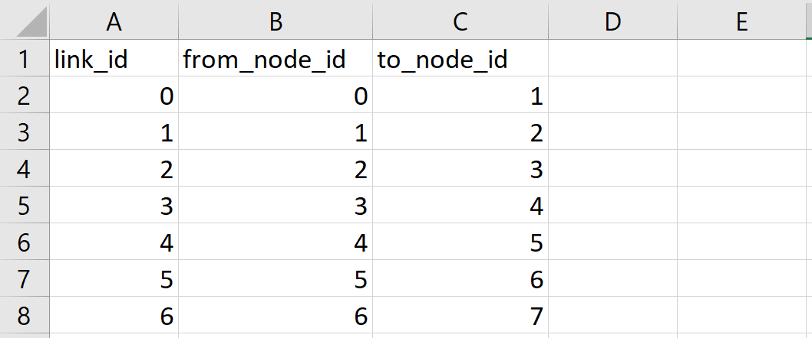
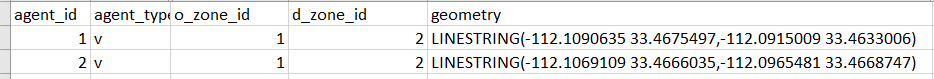
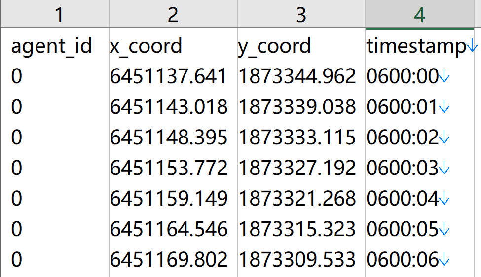
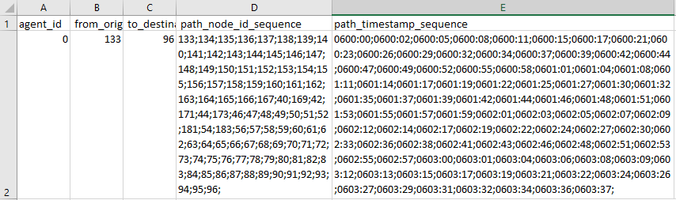

# Matching2Route

Please send your comments to <xzhou74@asu.edu> if you have any suggestions and
questions.

Based on input network and given GPS trajectory data, the map-matching program
of Matching2Route aims to find most likely route in terms of node sequence in
the underlying network, with the following data flow chart.

The 2D grid system aims to speed up the indexing of GSP points to the network.
For example, a 10x10 grid for a network of 100 K nodes could lead to 1K nodes in
each cell. We first identify all cells traveled by a GPS trace, so only a small
subset of the network will be loaded in the resulting shortest path algorithm.

The link cost estimation step calculates a generalized weight/cost for each link
in the cell, that is, the distance from nearly GPS points to a link inside the
cell. The likely path finding algorithm selects the least cost path with the
smallest generalized cumulative cost from the beginning to the end of the GPS
trace.

1.  **Data flow**

| **Input files**              | **Output files** |
|------------------------------|------------------|
| node.csv                     | agent.csv        |
| link.csv                     |                  |
| input_agent.csv or trace.csv |                  |

2.  **Input file description**

    **File node.csv** gives essential node information of the underlying
    (subarea) network in GMNS format, including node_id, x_coord and y_coord.

**File link.csv** provides essential link information of the underlying
(subarea) network, including link_id, from_node_id and to_node_id.

**Input trace file, option 1, input_agent.csv** can be generated from package
grid2demand.

**Input trace file, option 2, trace.csv**, describes trajectory location points
of each agent. The timestamp format used here is hhmm:ss. In the future, we can
also use DTALite

1.  **Output file description**

    **File agent.csv** describes the most-likely path for each agent based on
    input trajectories.

**Reference:**

This code is implemented based on a published paper in Journal of Transportation
Research Part C:

Estimating the most likely space–time paths, dwell times and path uncertainties
from vehicle trajectory data: A time geographic method

https://www.sciencedirect.com/science/article/pii/S0968090X15003150
