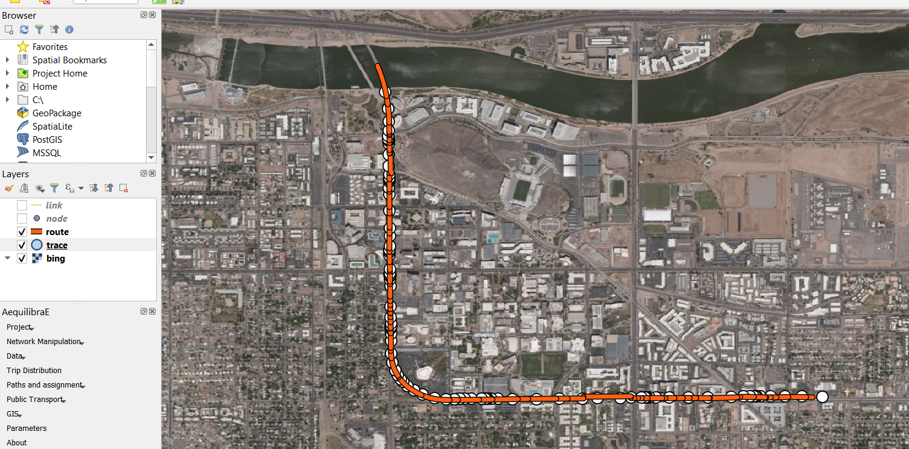
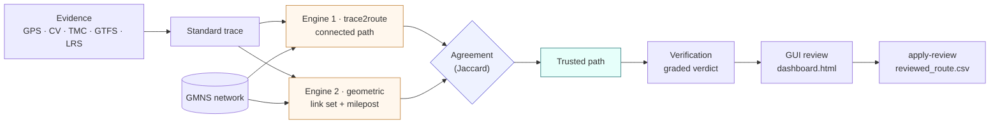
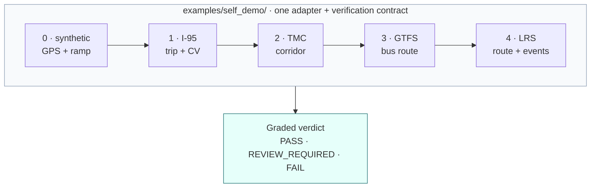
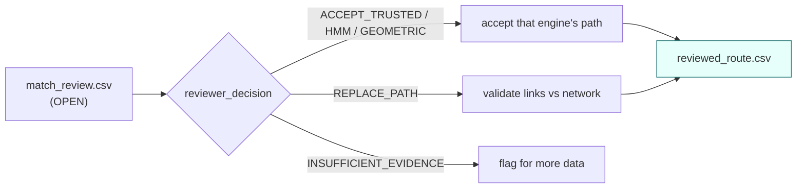
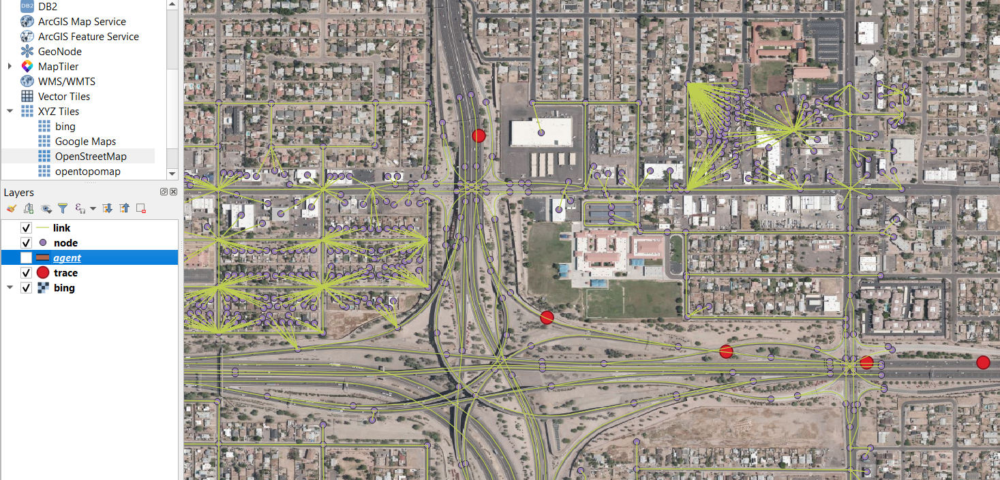
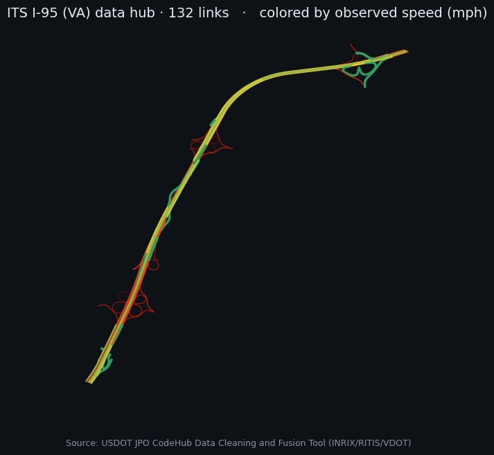

# MapMatching4GMNS

**Dual-engine map matching for GMNS.** Two independent matchers under one Python API — run
either, or **both**, because two engines agreeing is a quality signal. Map matching becomes a QC
step, not just preprocessing.

<p align="center">
  <br/>
  <em>Input: a noisy GPS <strong>trace</strong> (white). Output: the most-likely connected <strong>route</strong> (orange) on the GMNS network.</em>
</p>

**New here? Jump to the [🚀 Guided tour](#guided-tour--demos) for a 3-minute run.**

> Questions / suggestions: [xzhou74@asu.edu](mailto:xzhou74@asu.edu). The original walkthrough is
> in [`MapMatching4GMNS.ipynb`](MapMatching4GMNS.ipynb); example data is under `datasets/`.
> The full **two-engine user guide** (network / evidence / file schemas / algorithms) is below.

| | Engine 1 — native (`trace2route`) | Engine 2 — geometric |
|---|---|---|
| method | most-likely **connected path** (time-geographic; Tang et al. 2015) | centerline **projection** onto links |
| speed | ~0.3 s/corridor (loads network) | ~0.02 s (≈12× faster) |
| output | routable link sequence (assignment / OD) | link set + per-link **milepost** |
| build | C++ pybind module (`native/`) | pure Python |
| keyword | `engine="native"` *(legacy alias: `"hmm"`)* | `engine="geometric"` |

Median cross-engine link agreement on freeway corridors: **Jaccard ≈ 0.86** — trust the match
where they agree, flag it where they disagree.

> **Naming, so nobody trips on it.** Engine 1 (`trace2route`) is a *most-likely-path* matcher, **not
> a Hidden Markov Model** — the `hmm` keyword and the `hmm_*` output columns are legacy labels for
> Engine 1. The actual **HMM** package is [`mapmatcher4gmns`](https://github.com/yajunliu99/mapmatcher4gmns)
> by **Yajun Liu** — a *separate* project (one letter apart: **matcher** vs **matching**) that this
> package can optionally drive as a third engine. See [Attribution & ecosystem](#attribution--ecosystem).

## How it works

Every source becomes one **standard evidence**, both engines match it, and their **agreement**
drives a graded verdict and an optional human review — the same path for GPS, connected-vehicle,
TMC, GTFS, or LRS:


```mermaid
flowchart LR
    A["Evidence<br/>GPS · CV · TMC · GTFS · LRS"] --> B["Standard trace"]
    B --> C1["Engine 1 · trace2route<br/>connected path"]
    B --> C2["Engine 2 · geometric<br/>link set + milepost"]
    C1 --> D{"Agreement<br/>(Jaccard)"}
    C2 --> D
    D --> E["Trusted path"]
    E --> F["Verification<br/>graded verdict"]
    F --> G["GUI review<br/>dashboard.html"]
    G --> H["apply-review<br/>reviewed_route.csv"]
    NET[("GMNS network")] --> C1
    NET --> C2
    style C1 fill:#fff7ed,stroke:#c2843b
    style C2 fill:#fff7ed,stroke:#c2843b
    style D fill:#eef2ff,stroke:#4338ca
    style E fill:#e6fffa,stroke:#2c7a7b
```

## Install & quickstart

```bash
pip install -e .            # pandas + numpy  (add the native engine below for Engine 1)
```

```python
import mapmatching4gmns as mm

ev = mm.corridor_from_tmc("TMC_Identification.csv", road="I-95", direction="NORTHBOUND")
p1 = mm.match(ev, network_dir="network", engine="native")     # Engine 1: connected path (alias "hmm")
p2 = mm.match(ev, network_dir="network", engine="geometric")  # Engine 2: link set + milepost
qa = mm.match(ev, network_dir="network", engine="both")        # both + agreement + verdict
```

`engine="both"` returns a QA record: the two paths, their link Jaccard, direction / milepost /
gateway checks, and a resolved trusted path. Run the fully-open demo in `examples/synthetic/`.

## Self-testing / self-demo

The package is self-testing: a repeatable case pipeline (evidence → trace → both engines →
agreement → trusted path → verification → GUI review) that self-validates against a curated
baseline. The synthetic golden case runs in CI on every push.

```bash
mapmatching4gmns self-demo --case synthetic     # -> case_output/ + dashboard.html + SELF_DEMO_PASS.txt
mapmatching4gmns self-demo --all
mapmatching4gmns apply-review case_output/ --network network   # apply human review -> reviewed_route.csv
```

Each case also writes a `match_review.csv` review contract; a reviewer records a decision
(accept an engine's path, `REPLACE_PATH`, or flag `INSUFFICIENT_EVIDENCE`) and `apply-review`
regenerates a corrected route **without editing the GMNS network**. See `docs/SELF_DEMO.md`.

Ownership boundary: **evidence adapter + route matching + match verification + visual review** —
it does not judge which network is globally "best" (that is `qaqc4gmns`). Six cases all run in CI
through the **same adapter + verification contract** — synthetic GPS · I-95 trip/CV · TMC · GTFS ·
LRS — each with a self-contained synthetic fixture. See `docs/SELF_DEMO.md`.

## Guided tour & demos

**3-minute run — no data, no native build (Engine 2 works out of the box):**

```bash
pip install -e .
mapmatching4gmns self-demo --all        # runs all 6 cases; writes case_output/ + dashboard.html
```

Open any `examples/self_demo/<case>/case_output/dashboard.html` — a self-contained page (no
internet) with toggleable **raw trace / Engine 1 (native) / geometric / trusted** layers and the graded verdict.

The six demo cases are a ladder — each new source type is just a new adapter behind the **same
verification contract**, not a one-off script:


```mermaid
flowchart TD
    subgraph LADDER["examples/self_demo/ · one adapter + verification contract"]
      direction LR
      c0["0 · synthetic<br/>GPS + ramp"] --> c1["1 · I-95<br/>trip + CV"] --> c2["2 · TMC<br/>corridor"] --> c3["3 · GTFS<br/>bus route"] --> c4["4 · LRS<br/>route + events"]
    end
    LADDER --> V["Graded verdict<br/>PASS · REVIEW_REQUIRED · FAIL"]
    style LADDER fill:#f8fafc,stroke:#94a3b8
    style V fill:#e6fffa,stroke:#2c7a7b
```

**Human-in-the-loop review** (`apply-review`) turns a reviewer's decision into a corrected route —
without editing the GMNS network:


```mermaid
flowchart LR
    R["match_review.csv<br/>(OPEN)"] --> DEC{"reviewer_decision"}
    DEC -->|"ACCEPT_TRUSTED / HMM / GEOMETRIC"| OK["accept that engine's path"]
    DEC -->|"REPLACE_PATH"| CHK["validate links vs network"]
    DEC -->|"INSUFFICIENT_EVIDENCE"| FLAG["flag for more data"]
    OK --> OUT["reviewed_route.csv"]
    CHK --> OUT
    style OUT fill:#e6fffa,stroke:#2c7a7b
```

### Where to look

| Try this | Path / command |
|---|---|
| Fully-open corridor + TMC demo | [`examples/synthetic/`](examples/synthetic/) |
| Run the whole ladder | `mapmatching4gmns self-demo --all` |
| One case + dashboard | `mapmatching4gmns self-demo --case gtfs` → `examples/self_demo/03_gtfs/case_output/dashboard.html` |
| Apply a review | `mapmatching4gmns apply-review case_output/ --network network` |
| Interactive visualization portal | open [`examples/portals/i95_va/datahub.html`](examples/portals/i95_va/) (deck.gl) or `gmns.kml` in Google Earth |
| Classic single-engine walkthrough | [`MapMatching4GMNS.ipynb`](MapMatching4GMNS.ipynb) |
| The QA method / datasets / ecosystem | [`docs/SELF_DEMO.md`](docs/SELF_DEMO.md) · [`docs/DUAL_ENGINE.md`](docs/DUAL_ENGINE.md) · [`docs/ECOSYSTEM.md`](docs/ECOSYSTEM.md) |

<table>
<tr>
<td width="50%" align="center">
  <br/>
  <em>GMNS network + GPS trace in QGIS — the matcher's inputs.</em>
</td>
<td width="50%" align="center">
  <br/>
  <em>The bundled I-95 portal (<code>examples/portals/i95_va/</code>) — links by observed speed.</em>
</td>
</tr>
</table>

## Build the native engine (Engine 1)

The most-likely-path matcher is a portable C++ pybind module in `native/` (also buildable as the
classic Visual Studio project via `native/trace2route.sln` / `CMakeLists.txt`):

```bash
cd native
bash build_pybind.sh              # -> mapmatching4gmns_engine.<ext>
MM_OPENMP=1 bash build_pybind.sh  # optional: parallel batch matching
```

Then `export MAPMATCHING4GMNS_ENGINE_DIR=/path/to/native`. Without it, Engine 1 falls back to a
`trace2route.exe` if present; Engine 2 always works. See `native/PORTABILITY_NOTES.md`.

**This release hardens `trace2route`**: portable build (MFC-free), in-process pybind module,
memory-leak fix (TD-array deallocation), `link_id` preserved as a string (`AB`/`BA` direction
suffix), and opt-in OpenMP for parallel batch matching.

## What's in the box

- `mapmatching4gmns/` — Python package (both engines + `compare`/`dual_match` QA + schema)
- `native/` — the C++ `trace2route` engine (portable pybind + VS project + CMake)
- `docs/` — `DUAL_ENGINE.md` (the QA method), `ECOSYSTEM.md`
- `examples/synthetic/` — a fully-open corridor + TMC demo
- `datasets/`, `MapMatching4GMNS.ipynb`, `media/`, `release/` — original data & walkthrough

Extras: `trace_segmenter` (recover **loop** routes that collapse as one o→d), `mm_metrics`
(coverage ratio — unit-robust; raw link count is not comparable across networks), `gtfs2trace`.

## Attribution & ecosystem

**This package — `mapmatching4gmns`** (Engine 1 `trace2route` + Engine 2 geometric, with
agreement-based QA) is by **Xuesong (Simon) Zhou**. `trace2route` (Engine 1) is a most-likely-path
matcher (time-geographic; Tang et al. 2015).

**A separate package — `mapmatcher4gmns`** (note: *matcher*, not *matching*) by **Yajun Liu**
([github.com/yajunliu99/mapmatcher4gmns](https://github.com/yajunliu99/mapmatcher4gmns),
[PyPI](https://pypi.org/project/mapmatcher4gmns/)) is a **Hidden Markov Model** matcher, inspired by
and referencing [TrackIt / GoTrackIt](https://github.com/zdsjjtTLG/TrackIt) (TangKai et al.,
Hangzhou Zecheng Data Technology). It is a distinct project — not an engine of this one.

| | `mapmatching4gmns` (this) | `mapmatcher4gmns` (Yajun Liu) |
|---|---|---|
| what | dual-engine matcher + agreement QA | single HMM matcher |
| engines | Engine 1 native `trace2route` (most-likely path) · Engine 2 geometric | HMM (TrackIt/GoTrackIt lineage) |
| relation | can optionally call the other as a **third** engine | standalone |

**Optional third engine.** `mapmatcher4gmns_adapter` is a seam to run Yajun Liu's HMM matcher as a
third engine. That HMM path is **currently gated** (the wrapper raises `NotImplementedError`)
pending upstream fixes tracked in the adapter — Engine 2 (geometric) is the always-available
default and Engine 1 (native) the primary alternative. Don't confuse the two package names: they
differ by one word (**matcher** vs **matching**) and cover different algorithms.

Part of the [ASU Trans-AI Lab](https://github.com/asu-trans-ai-lab) GMNS toolchain; used by
**Subarea2GMNS** to seed subarea OD (`docs/ECOSYSTEM.md`). MIT licensed.

---

# User guide (two engines)

## 1. Introduction

Given a GMNS network and location evidence (a GPS trace, a TMC corridor, a GTFS shape, an LRS
route, …), MapMatching4GMNS finds the route each trajectory most likely took, using **two
independent engines**:

- **Engine 1 — `trace2route` (native).** The most-likely **connected path** (node sequence) in the
  network — a routable path suitable for assignment / OD. This is the classic engine described in
  the sections below; run it via the in-process pybind module (`native/`) or the legacy
  `trace2route.exe`.
- **Engine 2 — geometric.** Centerline **projection** of the evidence onto links — a link set with
  a per-link **milepost**. Pure Python, ~12× faster, always available.

Run either, or **both**: where the two agree (link Jaccard), trust the match; where they disagree,
flag it. That agreement check is the QA the single-engine tool could not give you. GMNS: General
Modeling Network Specification (<https://github.com/zephyr-data-specs/GMNS>).

```python
import mapmatching4gmns as mm
p1 = mm.match(ev, network_dir="network", engine="native")     # Engine 1: connected path (alias "hmm")
p2 = mm.match(ev, network_dir="network", engine="geometric")  # Engine 2: link set + milepost
qa = mm.match(ev, network_dir="network", engine="both")        # both + agreement + verdict
```

## 2. Data flow

Both engines read the **same** GMNS network and the same evidence, and each writes its own matched
result; `engine="both"` adds the agreement/verdict record:

| stage | files | data source | produced by | visualization |
|---|---|---|---|---|
| GMNS network input | `node.csv`, `link.csv` | [osm2gmns](https://osm2gmns.readthedocs.io/) and other X2GMNS converters | — | [QGIS](https://www.qgis.org/), [GMNS web viewer](https://asu-trans-ai-lab.github.io/index.html#/), `dashboard.html` |
| evidence input | `trace.csv` (GPS/CV) · `TMC_Identification.csv` · GTFS `shapes.txt` · LRS `route.csv` | GPS traces (e.g. [`release/get_gps_trace.py`](release/get_gps_trace.py)); INRIX/RITIS TMC; open GTFS feeds; DOT LRS | evidence **adapters** (`mapmatching4gmns/adapters/`) | QGIS |
| Engine 1 output | `route.csv` (connected path) | — | `trace2route` (native / `.exe`) | QGIS, `dashboard.html` |
| Engine 2 output | link set + per-link milepost | — | geometric matcher (Python) | QGIS, `dashboard.html` |
| QA / agreement | `engine_comparison.csv`, `match_verification.csv`, `match_review.csv` | — | `engine="both"` + verification | `dashboard.html` |

**Native Engine 1**: build the pybind module (`native/build_pybind.sh`) or use the legacy
`trace2route.exe` from [`release/`](release/). **Engine 2** needs no build.

## 3. File description

**`node.csv`** — essential node information in GMNS format: `node_id`, `x_coord`, `y_coord`.

**`link.csv`** — essential link information of the underlying (subarea) network: `from_node_id`,
`to_node_id`, `link_type`, `length`/`geometry`. Both engines use `geometry` (WKT); `link_type`
selects the matchable facility class (e.g. freeway vs. frontage vs. local). Engine 2 preserves the
`link_id` string (the `AB`/`BA` direction suffix is kept).

**Evidence / trace input** — the agent ID (a string) is the trajectory ID; `x_coord`/`y_coord` must
be in the same CRS as the network. **Engine 1** additionally uses `o_node_id`/`d_node_id` to fix the
start/end of the most-likely-path search, and `hh`,`mm`,`ss` for GPS timestamps (separate columns
avoid time-format confusion). For TMC corridors, bus shapes, or LRS routes, timestamps are not
needed but the origin (first coordinate) must be specified. In the two-engine API you normally do
**not** write this file by hand: an **adapter** turns each source into one standard evidence that
both engines consume identically (see `adapters/` and `docs/SELF_DEMO.md`).

**Outputs** — Engine 1 `route.csv` (the most-likely connected path per agent, with free-flow link
travel time/delay); Engine 2 the matched link set + milepost; and, for `engine="both"`, the
cross-engine agreement and a graded verdict.

## 4. Visualization

- **In QGIS** — load `node.csv`/`link.csv`, the input trace, and each engine's route
  (Layer → Add → Add Delimited Text Layer; point geometry for nodes, WKT for links) over an
  OpenStreetMap XYZ-tiles background. See `media/` for step screenshots.
- **Self-contained** — every self-demo case writes a `dashboard.html` with toggleable
  raw-trace / Engine 1 / Engine 2 / trusted layers and the verdict (no internet needed).
- **Interactive portal** — `examples/portals/i95_va/` (deck.gl / Google Earth / kepler).

## 5. Algorithms

**Engine 1 — `trace2route` (most-likely connected path):**

1. Read the GMNS network (node/link) and the evidence `trace.csv`.
2. Convert `trace.csv` to `input_agent.csv` for NeXTA visualization.
3. Build a 2D grid to speed up indexing of trajectory points to the network.
4. Identify the traversed subarea per trace, so only a small subset of the network enters the
   shortest-path step.
5. Identify origin/destination nodes in the grid per trace (boundary O/D if the trace starts/ends
   outside a node).
6. Estimate link cost = distance from nearby trajectory points to each link in the cell.
7. Least generalized-cost path from the trace start to end (the connected route).
8. Match timestamps of each node along the likely path.
9. Output `route.csv` with estimated link travel time and delay (free-flow based).

**Engine 2 — geometric (projection):** for each evidence segment, project onto nearby links of the
allowed facility class, order the matched links by projected milepost, and emit the link set with
per-link mileposts. No path search — fast, and independent of Engine 1 by construction.

**Agreement / QA:** compare the two link sets by Jaccard, check direction / milepost monotonicity /
gateway traversal, resolve a **trusted** path (a connected Engine-1 path when available, else
Engine 2), and grade the result (`PASS` · `PASS_WITH_ENGINE_DISAGREEMENT` · `REVIEW_REQUIRED` ·
`FAIL`). See `docs/DUAL_ENGINE.md`.

## Reference

Engine 1 is implemented partially based on: Tang J, Song Y, Miller HJ, Zhou X (2015), "Estimating
the most likely space–time paths, dwell times and path uncertainties from vehicle trajectory data:
A time geographic method," *Transportation Research Part C*,
<http://dx.doi.org/10.1016/j.trc.2015.08.014>
