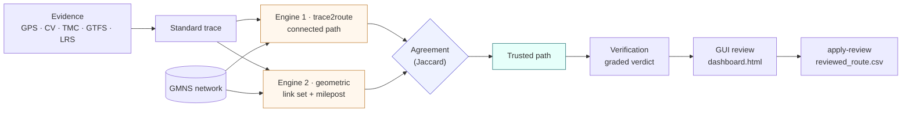
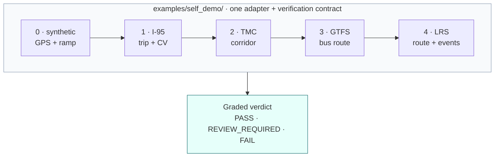
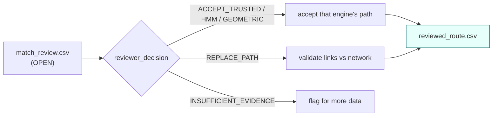

# MapMatching4GMNS

**Dual-engine map matching for GMNS.** Two independent matchers under one Python API — run
either, or **both**, because two engines agreeing is a quality signal. Map matching becomes a QC
step, not just preprocessing.

<p align="center">
  <br/>
  <em>Input: a noisy GPS <strong>trace</strong> (white). Output: the most-likely connected <strong>route</strong> (orange) on the GMNS network.</em>
</p>

**New here? Jump to the [🚀 Guided tour](#guided-tour--demos) for a 3-minute run.**

> Questions / suggestions: [xzhou74@asu.edu](mailto:xzhou74@asu.edu). The original walkthrough is
> in [`MapMatching4GMNS.ipynb`](MapMatching4GMNS.ipynb); example data is under `datasets/`.
> The classic single-engine user guide is preserved below (sections 1–5).

| | Engine 1 — HMM / native | Engine 2 — geometric |
|---|---|---|
| method | `trace2route` — most-likely **connected path** | centerline **projection** onto links |
| speed | ~0.3 s/corridor (loads network) | ~0.02 s (≈12× faster) |
| output | routable link sequence (assignment / OD) | link set + per-link **milepost** |
| build | C++ pybind module (`native/`) | pure Python |

Median cross-engine link agreement on freeway corridors: **Jaccard ≈ 0.86** — trust the match
where they agree, flag it where they disagree.

## How it works

Every source becomes one **standard evidence**, both engines match it, and their **agreement**
drives a graded verdict and an optional human review — the same path for GPS, connected-vehicle,
TMC, GTFS, or LRS:


```mermaid
flowchart LR
    A["Evidence<br/>GPS · CV · TMC · GTFS · LRS"] --> B["Standard trace"]
    B --> C1["Engine 1 · trace2route<br/>connected path"]
    B --> C2["Engine 2 · geometric<br/>link set + milepost"]
    C1 --> D{"Agreement<br/>(Jaccard)"}
    C2 --> D
    D --> E["Trusted path"]
    E --> F["Verification<br/>graded verdict"]
    F --> G["GUI review<br/>dashboard.html"]
    G --> H["apply-review<br/>reviewed_route.csv"]
    NET[("GMNS network")] --> C1
    NET --> C2
    style C1 fill:#fff7ed,stroke:#c2843b
    style C2 fill:#fff7ed,stroke:#c2843b
    style D fill:#eef2ff,stroke:#4338ca
    style E fill:#e6fffa,stroke:#2c7a7b
```

## Install & quickstart

```bash
pip install -e .            # pandas + numpy  (add the native engine below for Engine 1)
```

```python
import mapmatching4gmns as mm

ev = mm.corridor_from_tmc("TMC_Identification.csv", road="I-95", direction="NORTHBOUND")
p1 = mm.match(ev, network_dir="network", engine="hmm")        # connected path (native)
p2 = mm.match(ev, network_dir="network", engine="geometric")  # link set + milepost
qa = mm.match(ev, network_dir="network", engine="both")        # both + agreement + verdict
```

`engine="both"` returns a QA record: the two paths, their link Jaccard, direction / milepost /
gateway checks, and a resolved trusted path. Run the fully-open demo in `examples/synthetic/`.

## Self-testing / self-demo

The package is self-testing: a repeatable case pipeline (evidence → trace → both engines →
agreement → trusted path → verification → GUI review) that self-validates against a curated
baseline. The synthetic golden case runs in CI on every push.

```bash
mapmatching4gmns self-demo --case synthetic     # -> case_output/ + dashboard.html + SELF_DEMO_PASS.txt
mapmatching4gmns self-demo --all
mapmatching4gmns apply-review case_output/ --network network   # apply human review -> reviewed_route.csv
```

Each case also writes a `match_review.csv` review contract; a reviewer records a decision
(accept an engine's path, `REPLACE_PATH`, or flag `INSUFFICIENT_EVIDENCE`) and `apply-review`
regenerates a corrected route **without editing the GMNS network**. See `docs/SELF_DEMO.md`.

Ownership boundary: **evidence adapter + route matching + match verification + visual review** —
it does not judge which network is globally "best" (that is `qaqc4gmns`). Six cases all run in CI
through the **same adapter + verification contract** — synthetic GPS · I-95 trip/CV · TMC · GTFS ·
LRS — each with a self-contained synthetic fixture. See `docs/SELF_DEMO.md`.

## Guided tour & demos

**3-minute run — no data, no native build (Engine 2 works out of the box):**

```bash
pip install -e .
mapmatching4gmns self-demo --all        # runs all 6 cases; writes case_output/ + dashboard.html
```

Open any `examples/self_demo/<case>/case_output/dashboard.html` — a self-contained page (no
internet) with toggleable **raw trace / HMM / geometric / trusted** layers and the graded verdict.

The six demo cases are a ladder — each new source type is just a new adapter behind the **same
verification contract**, not a one-off script:


```mermaid
flowchart TD
    subgraph LADDER["examples/self_demo/ · one adapter + verification contract"]
      direction LR
      c0["0 · synthetic<br/>GPS + ramp"] --> c1["1 · I-95<br/>trip + CV"] --> c2["2 · TMC<br/>corridor"] --> c3["3 · GTFS<br/>bus route"] --> c4["4 · LRS<br/>route + events"]
    end
    LADDER --> V["Graded verdict<br/>PASS · REVIEW_REQUIRED · FAIL"]
    style LADDER fill:#f8fafc,stroke:#94a3b8
    style V fill:#e6fffa,stroke:#2c7a7b
```

**Human-in-the-loop review** (`apply-review`) turns a reviewer's decision into a corrected route —
without editing the GMNS network:


```mermaid
flowchart LR
    R["match_review.csv<br/>(OPEN)"] --> DEC{"reviewer_decision"}
    DEC -->|"ACCEPT_TRUSTED / HMM / GEOMETRIC"| OK["accept that engine's path"]
    DEC -->|"REPLACE_PATH"| CHK["validate links vs network"]
    DEC -->|"INSUFFICIENT_EVIDENCE"| FLAG["flag for more data"]
    OK --> OUT["reviewed_route.csv"]
    CHK --> OUT
    style OUT fill:#e6fffa,stroke:#2c7a7b
```

### Where to look

| Try this | Path / command |
|---|---|
| Fully-open corridor + TMC demo | [`examples/synthetic/`](examples/synthetic/) |
| Run the whole ladder | `mapmatching4gmns self-demo --all` |
| One case + dashboard | `mapmatching4gmns self-demo --case gtfs` → `examples/self_demo/03_gtfs/case_output/dashboard.html` |
| Apply a review | `mapmatching4gmns apply-review case_output/ --network network` |
| Interactive visualization portal | open [`examples/portals/i95_va/datahub.html`](examples/portals/i95_va/) (deck.gl) or `gmns.kml` in Google Earth |
| Classic single-engine walkthrough | [`MapMatching4GMNS.ipynb`](MapMatching4GMNS.ipynb) |
| The QA method / datasets / ecosystem | [`docs/SELF_DEMO.md`](docs/SELF_DEMO.md) · [`docs/DUAL_ENGINE.md`](docs/DUAL_ENGINE.md) · [`docs/ECOSYSTEM.md`](docs/ECOSYSTEM.md) |

<table>
<tr>
<td width="50%" align="center">
  <br/>
  <em>GMNS network + GPS trace in QGIS — the matcher's inputs.</em>
</td>
<td width="50%" align="center">
  <br/>
  <em>The bundled I-95 portal (<code>examples/portals/i95_va/</code>) — links by observed speed.</em>
</td>
</tr>
</table>

## Build the native engine (Engine 1)

The most-likely-path matcher is a portable C++ pybind module in `native/` (also buildable as the
classic Visual Studio project via `native/trace2route.sln` / `CMakeLists.txt`):

```bash
cd native
bash build_pybind.sh              # -> mapmatching4gmns_engine.<ext>
MM_OPENMP=1 bash build_pybind.sh  # optional: parallel batch matching
```

Then `export MAPMATCHING4GMNS_ENGINE_DIR=/path/to/native`. Without it, Engine 1 falls back to a
`trace2route.exe` if present; Engine 2 always works. See `native/PORTABILITY_NOTES.md`.

**This release hardens `trace2route`**: portable build (MFC-free), in-process pybind module,
memory-leak fix (TD-array deallocation), `link_id` preserved as a string (`AB`/`BA` direction
suffix), and opt-in OpenMP for parallel batch matching.

## What's in the box

- `mapmatching4gmns/` — Python package (both engines + `compare`/`dual_match` QA + schema)
- `native/` — the C++ `trace2route` engine (portable pybind + VS project + CMake)
- `docs/` — `DUAL_ENGINE.md` (the QA method), `ECOSYSTEM.md`
- `examples/synthetic/` — a fully-open corridor + TMC demo
- `datasets/`, `MapMatching4GMNS.ipynb`, `media/`, `release/` — original data & walkthrough

Extras: `trace_segmenter` (recover **loop** routes that collapse as one o→d), `mm_metrics`
(coverage ratio — unit-robust; raw link count is not comparable across networks), `gtfs2trace`.

## Attribution & ecosystem

`trace2route` / **MapMatching4GMNS** is by **Xuesong (Simon) Zhou**. The related PyPI package
[`mapmatcher4gmns`](https://pypi.org/project/mapmatcher4gmns/) (by Yajun) is a *separate*
geometric/HMM matcher — `mapmatcher4gmns_adapter` can drive it as a third engine. Part of the
[ASU Trans-AI Lab](https://github.com/asu-trans-ai-lab) GMNS toolchain; used by **Subarea2GMNS**
to seed subarea OD (`docs/ECOSYSTEM.md`). MIT licensed.

*Not to be confused with `mapmatcher4gmns` — this package (`mapmatching4gmns`) integrates both the
native trace2route and geometric engines with agreement-based QA.*

---

# Classic user guide (single-engine trace2route)

## 1. Introduction

Based on input network and given GPS trajectory data, the map-matching program of MapMatching4GMNS (trace2route.exe) aims to find the most likely route in terms of node sequence in the underlying network, with the following data flow chart.

GMNS: General Modeling Network Specification (GMNS) (<https://github.com/zephyr-data-specs/GMNS>)

## 2. Data flow

|                              | **files**          | **Data Source**                                                                                                                                                 | **Visualization**                                                                                                |
|------------------------------|--------------------|-----------------------------------------------------------------------------------------------------------------------------------------------------------------|------------------------------------------------------------------------------------------------------------------|
| GMNS network input           | node.csv, link.csv | [Openstreetmap](https://osm2gmns.readthedocs.io/en/latest/)                                                                                                     | [QGIS](https://www.qgis.org/en/site/), [web interface for GMNS](https://asu-trans-ai-lab.github.io/index.html#/) |
| Location sequence data input | trace.csv          | GPS traces downloaded from OpenStreetMap, e.g., using the script at <https://github.com/asu-trans-ai-lab/MapMatching4GMNS/blob/master/release/get_gps_trace.py> | QGIS                                                                                                             |
| Map-matched output           | route.csv          |                                                                                                                                                                 | QGIS                                                                                                             |

**Windows Executable: trace2route.exe** can be found from <https://github.com/asu-trans-ai-lab/MapMatching4GMNS/tree/master/release>

## 3. File description

**File node.csv** gives essential node information of the underlying network in GMNS format, including node_id, x_coord and y_coord.

**File link.csv** should include essential link information of the underlying (subarea) network, including from_node_id, to_node_id, length and geometry.

**Input trace file:** the agent ID (as a string) corresponds to the GPS trace ID. Ensure x_coord and y_coord match the network coordinates in node.csv/link.csv. Fields o_node_id and d_node_id establish a clear starting and ending point for the most-likely-route search. Fields hh, mm, ss correspond to the GPS timestamp (separate columns to avoid time-format confusion). For mapping TMC corridors or bus lines to a network, hh/mm/ss are not needed, but the origin node (first coordinate point) must be specified.

**Output file route.csv** describes the most-likely path for each agent based on input trajectories.

## 4. Visualization

Load the GMNS `node.csv`/`link.csv`, input trace, and output `route.csv` in **QGIS**
(Layer → Add → Add Delimited Text Layer; point geometry for nodes, WKT for links), with an
OpenStreetMap XYZ-tiles background. See `media/` for step screenshots.

## 5. Algorithm

1. Read GMNS network (node/link) and the GPS `trace.csv`.
2. trace2route converts `trace.csv` to `input_agent.csv` for NeXTA visualization.
3. Construct a 2D grid to speed up indexing of GPS points to the network.
4. Identify the traversed subarea per trace, so only a small subset of the network is loaded in the shortest-path step.
5. Identify origin/destination nodes in the grid per trace (boundary O/D if the trace starts/ends outside a node).
6. Estimate link cost = distance from nearby GPS points to each link in the cell.
7. Likely-path finding: least generalized-cost path from the trace start to end.
8. Identify matched timestamps of each node along the likely path.
9. Output `route.csv` with estimated link travel time and delay (free-flow based).

## Reference

Implemented partially based on: Tang J, Song Y, Miller HJ, Zhou X (2015), "Estimating the most
likely space–time paths, dwell times and path uncertainties from vehicle trajectory data: A time
geographic method," *Transportation Research Part C*,
<http://dx.doi.org/10.1016/j.trc.2015.08.014>
