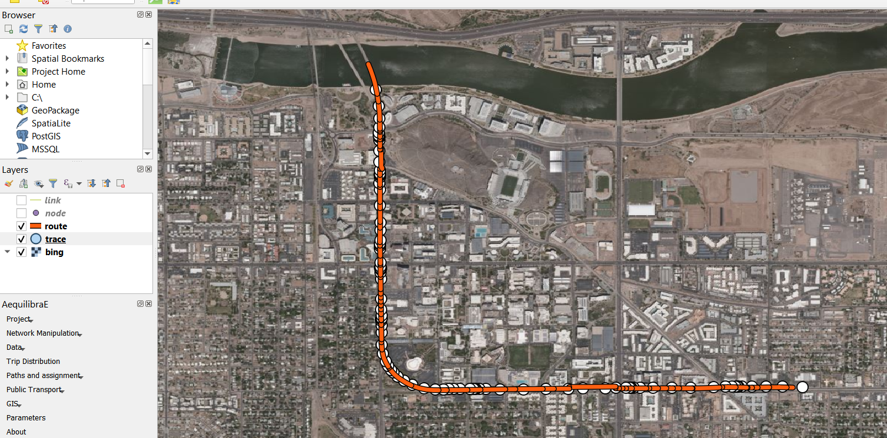

# MapMatching2GMNS

Please send your comments to <xzhou74@asu.edu> if you have any suggestions and
questions.

Based on input network and given GPS trajectory data, the map-matching program
of MapMatching4GMNS aims to find the most likely route in terms of node sequence
in the underlying network, with the following data flow chart.

**Test Python Script**:
<https://github.com/asu-trans-ai-lab/MapMatching4GMNS/blob/master/MapMatching4GMNS.ipynb>

[GMNS: General Modeling Network Specification (GMNS)
](<https://github.com/zephyr-data-specs/GMNS>)

**Data flow**

|                              | **files**          | **Source**                                                                           | **Visualization**                                                                                                |
|------------------------------|--------------------|--------------------------------------------------------------------------------------|------------------------------------------------------------------------------------------------------------------|
| GMNS network input           | node.csv, link.csv | [Osm2gmns](https://osm2gmns.readthedocs.io/en/latest/)                               | [QGIS](https://www.qgis.org/en/site/), [web interface for GMNS](https://asu-trans-ai-lab.github.io/index.html#/) |
| Location sequence data input | Trace.csv          | Demand generation model such as [Grid2demand](https://pypi.org/project/grid2demand/) | QGIS                                                                                                             |
| Map-matched output           | route.csv          |                                                                                      | QGIS                                                                                                             |

1.  **Read standard GMNS network files** node and link files

2.  **Read GPS trace.csv** file

    Note: the M2G program will convert trace.csv to input_agent.csv for
    visualization in NeXTA.

3.  **Construct 2d grid system** to speed up the indexing of GSP points to the
    network. For example, a 10x10 grid for a network of 100 K nodes could lead
    to 1K nodes in each cell.

4.  **Identify the related subarea** for the traversed cells by each GPS trace,
    so only a small subset of the network will be loaded in the resulting
    shortest path algorithm.

5.  **Identify the origin and destination** nodes in the grid for each GPS
    trace, in case, the GPS trace does not start from or end at a node inside
    the network (in this case, the boundary origin and destination nodes will be
    identified). The OD node identification is important to run the following
    shortest path algorithm.

6.  **Estimate link cost** to calculate a generalized weight/cost for each link
    in the cell, that is, the distance from nearly GPS points to a link inside
    the cell.

7.  Use **likely path finding algorithm** selects the least cost path with the
    smallest generalized cumulative cost from the beginning to the end of the
    GPS trace.

8.  **Identify matched timestamps** of each node in the likely path

9.  **Output route.csv** with **estimated link travel time and delay** based on
    free-flow travel time of each link along the GPS matched routes

**Input file description**

>   **File node.csv** gives essential node information of the underlying network
>   in GMNS format, including node_id, x_coord and y_coord.

**File link.csv** provides essential link information of the underlying
(subarea) network, including link_id, from_node_id and to_node_id.

**Input trace file** as

The agent id is GPS trace id, x_coord and y_coord should be consistent to the
network coordinate defined in node.csv and link.cvs. Fields hh mm and ss
correspond the hour, minute and second for the related GPS timestamp. We use
separate columns directly to avoid confusion caused by different time coding
formats.

**Output file description**

>   **File route.csv** describes the most-likely path for each agent based on
>   input trajectories.

## [media/118bf74177802fd8d8c67f149bf37801.png](media/118bf74177802fd8d8c67f149bf37801.png)

## Step 1: Load GMNS file in QGIS

Install and open QGIS and click on menu Layer-\>Add-\>Add Delimited Text Layer.
In the following dialogue box, load GMNS node.csv and link.csv, and ensure  
“point coordinates” is selected as geometry definition for node.csv wit x_coord
and y_coord for “Geometry field”, and WKT is selected as geometry definition for
link.csv.

Step 2: Load XYZ Tiles in QGIS with background maps

Find XYZ Tiles and double-click OpenStreetMap on Browser panel. Please move the
background layer to the bottom to show the GMNS network.

Refence:
<https://gis.stackexchange.com/questions/20191/adding-basemaps-from-google-or-bing-in-qgis>

## Step 3. Visualize input trace and output route files in QGIS

The 'geometry' field can be obtained from link.csv file. Then open this file in
the same way as above. (Menu Layer-\>Add-\>Add Delimited Text Layer)

**Reference:**

This code is implemented partially based on a published paper in Transportation
Research Part C:

Tang J, Song Y, Miller HJ, Zhou X (2015) “Estimating the most likely space–time
paths, dwell times and path uncertainties from vehicle trajectory data: A time
geographic method,” *Transportation Research Part C*,
<http://dx.doi.org/10.1016/j.trc.2015.08.014>
