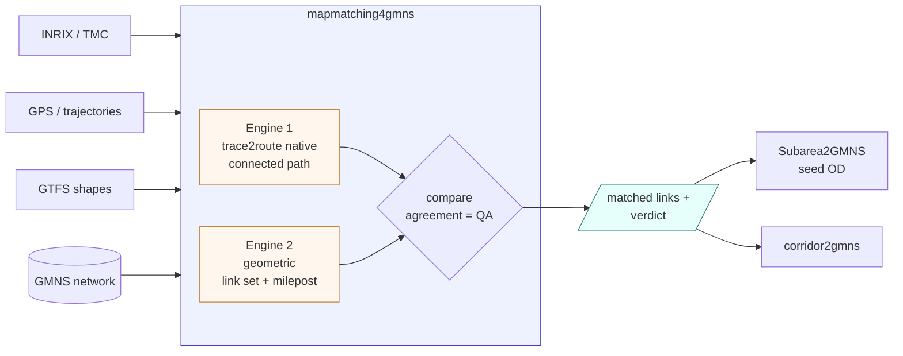

# Where mapmatching4gmns fits

A **component** in the GMNS toolchain: it takes traces/corridors + a GMNS network and returns
matched links (as a QA-checked dual-engine result). Other tools consume it — notably
Subarea2GMNS, which uses it to seed subarea OD.

| package | role | relation |
|---|---|---|
| **mapmatching4gmns** (this) | dual-engine map matching + QA | the matcher |
| MapMatching4GMNS (`trace2route`) | Zhou's C++ engine | **integrated here as Engine 1** |
| mapmatcher4gmns (PyPI, Yajun) | separate geometric/HMM matcher | optional 3rd engine via adapter |
| corridor2gmns | corridor evidence → GMNS | upstream evidence + consumer |
| Subarea2GMNS | corridor → subarea + OD | **downstream: uses this to seed OD** |
| osm2gmns / TAPLite / DTALite | network / assignment | network in, assignment downstream |
